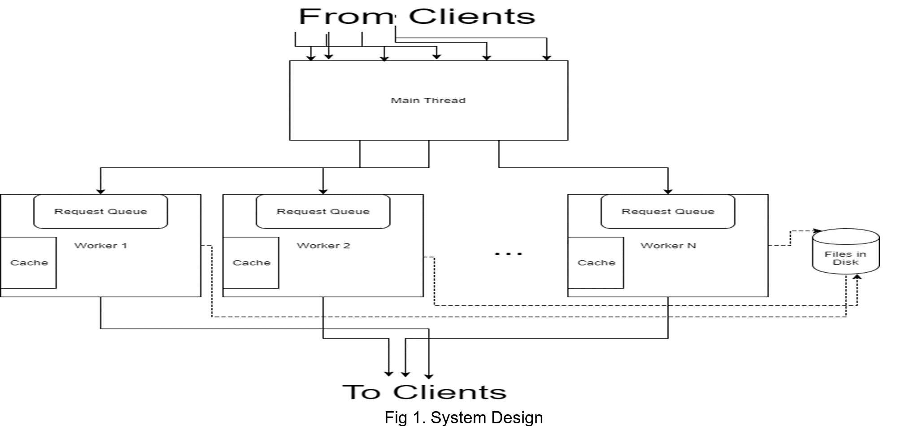
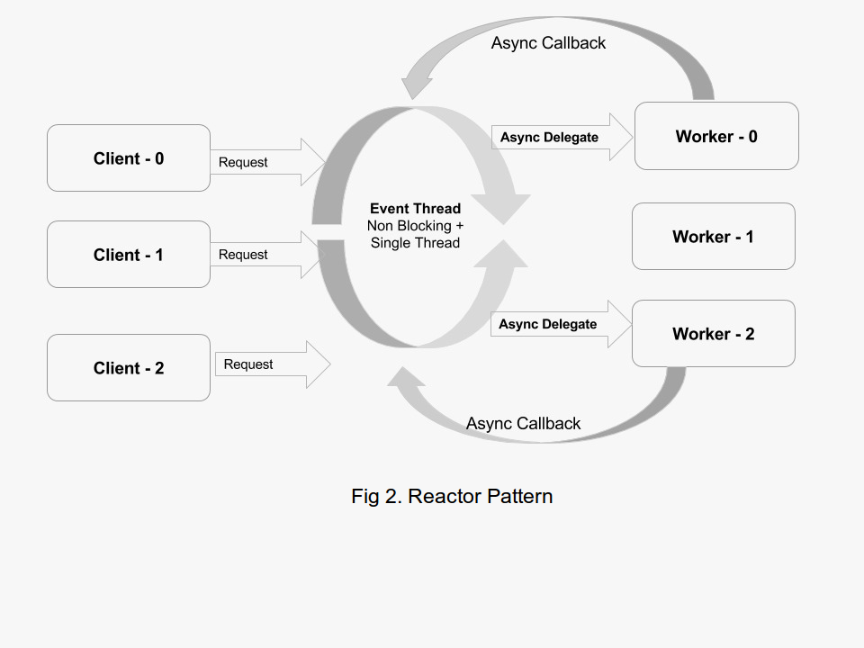
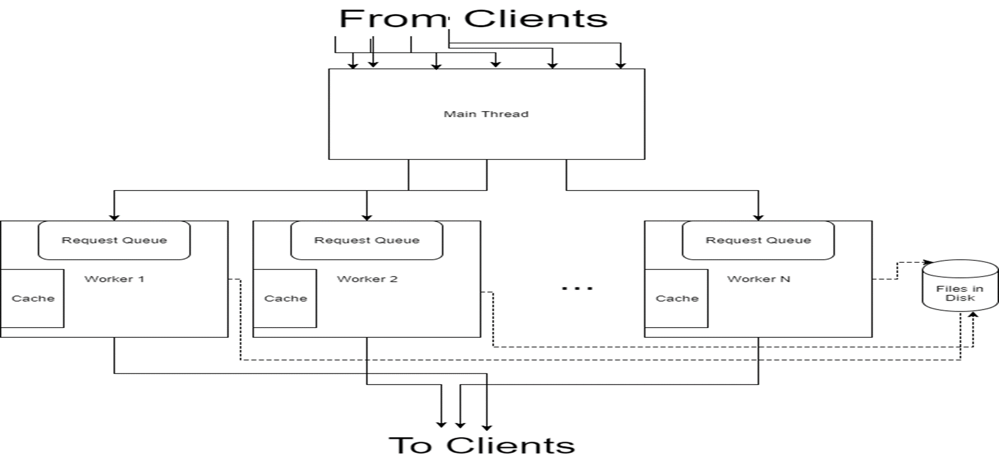
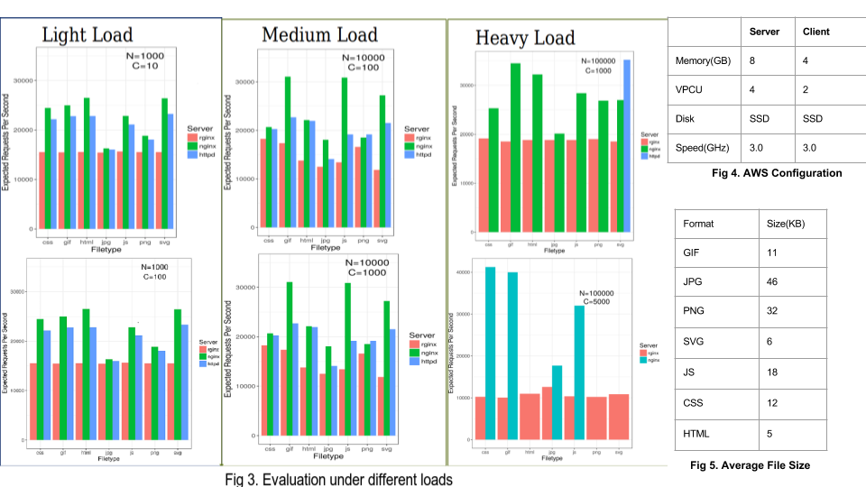

```{r setup, include=FALSE}
knitr::opts_chunk$set(echo = TRUE)
require('knitr')
require('ggplot2')
```

## Abstract

The goal of the project is to develop a high performance web server in an upcoming systems language - Rust. The web server architecture grew from a multi-threaded pool based implementation to a fully event driven architecture. The event driven architecture is an implementation of the Reactor pattern. The web server aims to be as performant as the more popular web servers like Apache Httpd and NGINX. By developing the webserver in a language which was built from the start keeping in mind the memory safety issues of C/C++ while maintaining performance, it helped us explore paradigms which are interesting and really effective in writing safe code.

## Contribution

Both the project members have contributed equally to overall system design, request processing and evaluation works. Following are the individual contributions:

Name           | Contribution
-------------  | -------------
Bishwajeet Dey | 1. Reactor model implementation \newline 2. Scripts for AWS evaluation and graph generation
Sriramprabhu Sankaraguru | Caching implementation 

## 1. Introduction
  In recent years, NGINX with its event driven architecture seems to rise as an alternative to Apache Httpd's thread per connection model. NGINX uses the reactor model internally across its worker processes. We wanted to understand, implement and evaluate such a pattern with a systems language - Rust.
  
  Rust is a safe, concurrent and practical systems language. Its syntax is similar to C++ but it offers various features like memory safety, concurrency safety and a better type system. Rust’s RAII feature will make sure that the unused resources are cleaned up once the variable goes out of scope. This helps developers to program without worrying about memory leaks and segmentation faults.
  
## 2. Novelty
  + A webserver which implements the Reactpr pattern in a systems language - Rust.
  + It leverages Rust's memory safety guarantees which guarantees no performance penalty. The resulting code is easier to understand, debug and maintain.
  + A deeper understanding of Aysnc IO and its performance under heavy load.

## 3. Design
{width=400px}{width=400px}

```{r, out.width = "300pt", echo=F, warning=F,eval=F}


```
  + **Reactor Pattern** - Fig 2 shows the reactor pattern. The reactor pattern is a pattern in which a single thread accepts tasks which can block (say I/O tasks). Each task has an event handler. The reactor manages a pool of handlers and runs in a tight loop. When a new task arrives, the reactor assigns an event handler from a pool. When the reactor runs, apart from assigning tasks to event handlers, it finds all the event handlers which are unblocked, either executes them or dispatches them to dispatchers. The reactor may choose to run the task to completion or run a part of it. \newline
  + **Reactor in a web server ** - The reactor pattern was slightly modified to suit our use case of serving files from a local directory. There is a main thread that runs on one core of the machine which accepts requests from the clients and adds it to the pending queue of the workers. There will be one worker running in each of the remaining cores of the machines. Each worker will have its own cache associated with it to store the small objects in memory. Each worker thread will periodically switch between processing the pending requests and accepting new requests. \newline
  + **Cache Manager** - To improve the response time of the query, we have a cache manager associated with each worker thread. It stores the contents of the frequently queried files. We have a limit on the maximum size of the file that can be stored in the memory. When a file request comes, we check the cache first and if it is present in the memory, we serve it from there. It reduces the disk I/O operations and improves the response time considerably. This cache uses LRU replacement policy. Cache manager also maintains freshness of the contents. When the content is modified, it will fetch the new contents instead of serving the old content. We have also provided optional compression feature. This will compress the contents of the files and store it in the cache. So, we can have more files in memory. \newline
  + **Rate Limiting** - Main thread will check the size of the pending queue of the worker thread before adding the request. If the queue is already full, it will send error message (503) to the client saying the server can’t accept any more request. \newline

# 4. Implementation
  + **Reactor** - The main thread accepts the TCP Stream from the client connection and forwards it to the worker. Worker reads the stream and gets the HTTP request from the user. It then adds it to the request queue. It then periodically iterates the queue and reads small chunk of data and writes it to appropriate stream. Once this iteration is over, it starts accepting requests. Once the file is completely written to the stream, it removes the request from the queue. It also contacts the cache before start reading from the disk. When a request comes, worker reads the metadata of the file and get the size and last modified time. If the size is less than the maximum file size a cache holds(50KB), then it queries the cache manager for the file contents. \newline
  + **Cache Manager**-Each worker thread will maintain a cache that can hold fixed number of small objects (<50KB). Cache stores the mapping between filename and its contents + metadata (last modified time). Cache uses LRU replacement policy. The cache manager will be queried with the filename, last modified time from the worker. It will first check if the entry is present in the cache. If the entry is present, it will server from memory. Cache manager maintains the freshness of the cached file by comparing the metadata stored along with it. It always servers fresh content to the client. For compression, we use Bzip compression technique. This reduces the size of the contents and enables us to store more data in memory. But when the cache hit rate is poor/there are fewer files where all of them can fit into cache, compression doesn’t yield the best result as we end up doing extra work. \newline
  + **Rate Limiting**-Main thread will check the size of the pending queue of the worker thread before adding the request. If the queue is already full, it will send error message (503) to the client saying the server can’t accept any more request. \newline
  + **Technical Challenges**
    * We first started with Thread per connection model which didn’t yield expected performance. Then we learned about the Nginx server model and moved to Event-driven architecture.
    * Being new to the Rust’s ownership model, we find it difficult to move the variables across functions. It took us time to read about the Rust type system and program accordingly.
    * When caching was added, we found that it had no effect on performance. As we revisited the code, we found that we clone the file content stored in the cache every time we return it as Rust doesn’t allow multiple ownerships. As the object size is big (50KB), calling Clone affected the performance badly. We fixed it and that improved the performance greatly.

# 5. Evaluation
{width=500pt}
We evaluated our server: `rginx` with 2 other popular webservers - `Apache Httpd` and `NGINX`. The evaluation was done with Apache benchmark on a 2 node cluster in AWS. The server was twice as powerful as the client. The specifications can be found in Fig 4. The file sizes which were used for testing can be found in Fig 5. These are the average sizes of files over the web.
  
  For the purpose of evaluation, we simulated 3 different loads - Low, Medium, High. The graph in Fig 3 shows the summary of our evaluation. `N` represents the number of connections, `C` represents the number of users(threads). The X axis represents the file formats on which we tested. The Y axis represents the expected number of requests for that graph. Expected number of requests per second is calculated as an inverse of mean of the time it took to serve 1 request.

  * **Light Load** - For this experiment, we simulated 1000 connections under 10 threads/ 100 threads. `NGINX` turned out to be fastest in both experiments. However, our performance is comparable to the other servers when it comes to JPG because JPGs cannot be compressed. \newline
  * **Medium Load** - We simulate medium load with 10000 connections with 100 threads/1000 threads. Our server once again hit a ceiling at 19,000 requets per second while both `httpd` and `NGINX` hit a wall at around 25,000 requests per second. \newpage
  * **Heavy Load** - When it comes to heavy load, our server turned out to be more robust than the both `httpd` and `NGINX`. We simulated 100,000 connections with 1000/5000 threads. Both `httpd` and `NGINX` dropped more than 10% of the requests with response code of 500 or 503. `rginx` was able to complete the test with an average of little over 10,000 requests/sec. \newline

## 6. Conclusion
  From the evaluation, we observe that our web server is slightly slower than the battle tested Apache Httpd and Nginx web servers. The primary reason is that both these webservers spawn multiple processes for serving requests while we had a single process to serve requests. We are confident that by extending the framework to support multiple processes, we would be able to match the performance of Httpd and NGINX. One more interesting fact is that as the load increases, Apache and Nginx started sending 503 error message but our server can still handle those connections. Our server turned out to be more robust under heavy load as compared to the other servers. 

